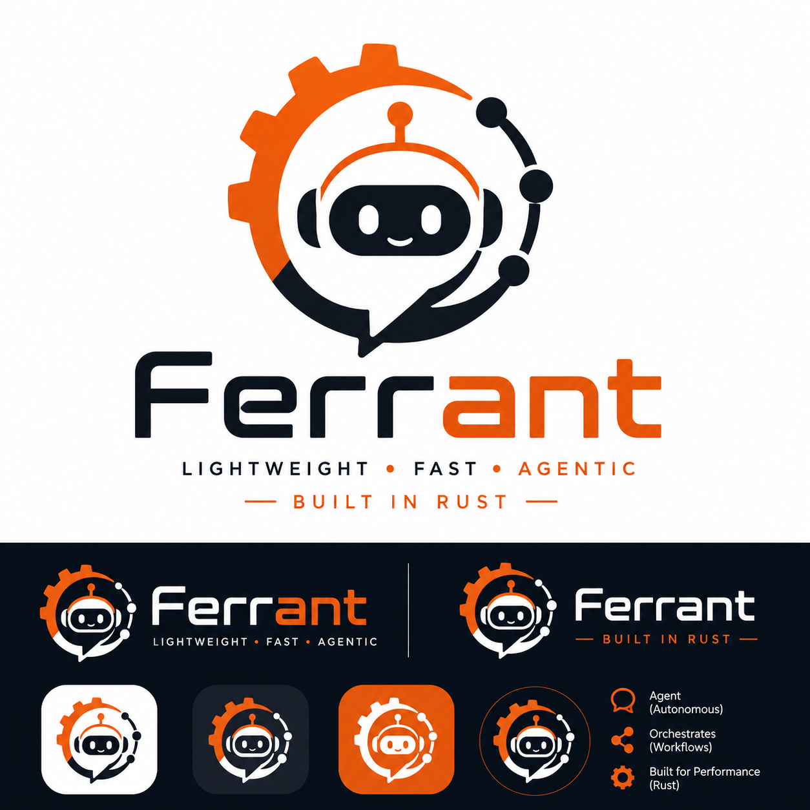

# ferrant

A lightweight, multi-provider **AI agent framework in pure Rust**. It gives you a small, dependency-light
core for building tool-using LLM agents: a `Model` trait for any provider, a
`Tool` trait for anything the agent can call, an `Agent` reasoning loop that
wires them together, and pluggable session storage.

## Features

- **Provider-agnostic** — `Model` trait with ready-made `OpenAiModel` (works
  with any OpenAI-compatible endpoint: OpenAI, Azure OpenAI, Groq, OpenRouter,
  Ollama, etc.) and `AnthropicModel` (Claude). Add your own provider by
  implementing one trait method.
- **Tool calling** — implement `Tool` for a struct, or build one instantly
  from a closure with `FunctionTool` / the `function_tool!` macro.
- **MCP tools** — connect to stdio MCP servers, discover their tools, and add
  them to an agent without writing adapters.
- **Multi-agent orchestration** — expose specialist agents as tools and let a
  coordinator delegate work and synthesize the result with `AgentTeam`.
- **Multimodal messages** — provider-neutral text, image, audio, and file
  content parts, with multimodal model responses preserved for applications.
- **Production execution controls** — native OpenAI and Anthropic streaming,
  including incremental tool-call arguments and usage events; exponential
  retry, model/tool timeouts, and parallel tool execution.
- **Provider-native structured output** — OpenAI strict `json_schema` response
  formats and Anthropic forced schema tools, followed by full JSON Schema
  validation and typed serde deserialization through `run_structured`.
- **Durable graph orchestration** — validated graphs with conditional routes,
  parallel fan-out, durable AND-joins, cycles, retries, timeouts, interrupts,
  human input, idempotency keys, checkpoint recovery, and optimistic
  concurrency.
- **Mature RAG pipeline** — loaders, lineage-aware chunking, local and OpenAI
  embeddings, mutable/persistent vector stores, metadata filters, hybrid
  retrieval, multi-query transformation, reranking, citation formatting, and
  a ready-made retrieval tool.
- **Observability and evaluation** — lifecycle tracing, OpenTelemetry export,
  token/usage aggregation, latency and failure metrics, concurrent evaluation
  datasets, composable scorers, and CI regression gates.
- **Curated integrations** — a validated, capability-indexed catalog keeps
  discovery metadata separate from optional factories and credentials.
- **Agent loop** — automatically calls tools the model asks for, feeds
  results back, and loops until the model produces a final answer (bounded by
  `max_steps` to avoid runaway loops).
- **Sessions & memory** — `Storage` persists conversation history per session;
  built-in in-memory and atomic file implementations share the same three-method
  trait used by database-backed adapters.
- **Small dependency surface** — tokio, reqwest, serde, async-trait, anyhow,
  thiserror. No heavyweight ML runtime; this is an orchestration layer.

## Project layout

```
src/
  lib.rs        # crate docs + re-exports
  agent.rs      # Agent + AgentBuilder (the reasoning loop)
  tool.rs       # Tool trait, ToolSpec, FunctionTool
  mcp.rs        # stdio MCP client + MCP-to-Tool adapter
  orchestration.rs # agent-as-tool + coordinator team
  graph.rs      # durable graph execution + checkpoint stores
  workflow.rs   # compact sequential durable workflow
  rag.rs        # ingestion, retrieval, reranking, citations, vector stores
  observability.rs # usage, metrics, and OpenTelemetry span adapters
  evaluation.rs # datasets, scorers, reports, and regression gates
  integrations.rs # curated capability catalog + factories
  persistence.rs # atomic snapshots + checksummed durable record logs
  memory.rs     # session Storage + in-memory/file backends
  runtime.rs    # execution policy + normalized stream events
  structured.rs # full JSON Schema validation
  message.rs    # Message / Role / ToolCall types
  error.rs      # AgentError
  llm/
    mod.rs        # Model trait + ModelResponse
    openai.rs     # OpenAiModel (OpenAI-compatible /chat/completions)
    anthropic.rs  # AnthropicModel (Anthropic /v1/messages)
examples/
  basic_agent.rs              # OpenAI + a closure-based weather tool
  custom_tool.rs               # struct-based tool + persisted session memory
  anthropic_agent.rs           # Claude + a closure-based tool
  openai_compatible_agent.rs   # Any OpenAI-compatible LLM server
  mcp_agent.rs                 # Agent using an MCP filesystem server
  multi_agent.rs               # Coordinator with specialist agents
  multimodal_input.rs          # Text + image input
  multimodal_output.rs         # Text + audio output
  advanced_runtime.rs          # Graph + RAG + OTel + evaluation end to end
  advanced_workflow.rs         # Durable fan-out/retry/join/approval example
python-wrapper/                # Optional PyO3/asyncio wrapper; Rust stays the core
server/
  runtime/                      # Generic Python inference server for function agents
  docker/                       # Reusable ferrant-runner image
  orchestrator/                 # Docker deployment orchestration contract
```

## Optional Python wrapper

The package in `python-wrapper/` is a small PyO3 binding, not a second
implementation. Agent execution, provider clients, MCP, RAG, streaming, and
durable graph scheduling all run in Rust; Python supplies an `asyncio`-friendly
API and optional synchronous callbacks for custom tools and workflow nodes.

```bash
pip install ferrant
```

```python
import asyncio
import os
from ferrant import Agent

async def main():
    agent = Agent.openai("gpt-5-nano", os.environ["OPENAI_API_KEY"])
    print(await agent.run("Hello from Python"))

asyncio.run(main())
```

Prebuilt wheels contain the native Rust core, so end users do not need Rust or
Maturin. The wrapper's `examples/` directory mirrors every top-level Rust
example and includes an advanced durable workflow matching
`examples/advanced_workflow.rs`.

## Function-agent CLI

Both the Rust crate and Python package install a `ferrant` CLI. It hosts a
plain Python function behind a standard JSON inference API, so an application
does not need to depend on FastAPI:

```bash
ferrant init echo-agent
cd echo-agent
ferrant run
```

`init` creates `agent.py` and `deploy.yml`; `run` serves `GET /health` and
`POST /infer` locally for development. Deployment is remote: the CLI packages
the application and uploads it to a Ferrant deployment server, which starts
the container using its own Docker daemon.

```bash
ferrant deploy --server https://deploy.example.com
```

See [deployment documentation](docs/deployment.md) for the handler contract.

## Quick start

```rust
use ferrant::agent::Agent;
use ferrant::llm::openai::OpenAiModel;

#[tokio::main]
async fn main() -> anyhow::Result<()> {
    let model = OpenAiModel::new("gpt-4o-mini", std::env::var("OPENAI_API_KEY")?);
    let mut agent = Agent::builder(model)
        .instructions("You are a concise, helpful assistant.")
        .build();

    let answer = agent.run("What is the capital of France?").await?;
    println!("{answer}");
    Ok(())
}
```

### Giving the agent a tool

```rust
use ferrant::tool::FunctionTool;
use serde_json::json;

let weather_tool = FunctionTool::new(
    "get_weather",
    "Get the current weather for a given city",
    json!({
        "type": "object",
        "properties": { "city": { "type": "string" } },
        "required": ["city"]
    }),
    |args| Box::pin(async move {
        let city = args["city"].as_str().unwrap_or("unknown");
        Ok(format!("It's sunny in {city}."))
    }),
);

let mut agent = Agent::builder(model)
    .instructions("Use tools when needed.")
    .tool(weather_tool)
    .build();
```

The agent loop will call the tool automatically whenever the model requests
it, feed the result back, and keep going until it has a final answer.

### MCP server tools

`McpClient` starts a stdio MCP server, performs the MCP initialization
handshake, discovers all paginated tools, and adapts them to `Arc<dyn Tool>`:

```rust
use ferrant::{Agent, McpClient};

let mcp = McpClient::connect(
    "npx",
    ["-y", "@modelcontextprotocol/server-filesystem", "."],
).await?;
let mut agent = Agent::builder(model)
    .tools(mcp.tools().await?)
    .build();
```

The server process is terminated when its client and all discovered tools are
dropped. Server logs are inherited on stderr, while stdout remains reserved
for MCP JSON-RPC messages.

### Multi-agent orchestration

Any `Agent` can become a coordinator-callable specialist through `AgentTool`.
`AgentTeam` provides the common coordinator pattern directly:

```rust
use ferrant::{Agent, AgentTeam};

let researcher = Agent::builder(research_model)
    .instructions("Research the task carefully.")
    .build();
let reviewer = Agent::builder(review_model)
    .instructions("Find risks and edge cases.")
    .build();

let mut team = AgentTeam::new(coordinator_model)
    .member("researcher", "Research and fact analysis", researcher)
    .member("reviewer", "Critical review and risk analysis", reviewer);
let answer = team.run("Develop and review a migration plan.").await?;
```

The coordinator chooses which members to call. Each member keeps independent
conversation history and calls to the same member are serialized safely.

### Multimodal input and output

Use `Message::user_parts` with `ContentPart` to combine text, remote images,
base64 image data, audio, and files. Use `Agent::run_message` when the caller
needs the complete `ModelResponse`; the existing `run` method remains a
text-only convenience API.

```rust
use ferrant::{ContentPart, Message};

let response = agent.run_message(Message::user_parts(vec![
    ContentPart::text("Describe this image"),
    ContentPart::image_url("https://example.com/image.jpg"),
])).await?;

for part in response.content_parts {
    match part {
        ContentPart::Audio { data, format, .. } => { /* decode base64 audio */ }
        ContentPart::ImageData { data, media_type, .. } => { /* decode image */ }
        _ => {}
    }
}
```

The OpenAI Chat Completions adapter maps image URL/data, audio, and file input
parts and parses text, image URL, and generated audio output. The Anthropic
adapter maps text, URL/base64 images, and base64 documents and preserves its
text output as content parts.

### Reliable execution and complete streaming

Configure runtime behavior once on the builder. The defaults use three model
attempts, exponential backoff, 60-second model timeouts, 30-second tool
timeouts, and parallel tool calls.

```rust
use ferrant::{Agent, ExecutionPolicy, InMemoryTracer};
use std::time::Duration;

let tracer = InMemoryTracer::default();
let mut agent = Agent::builder(model)
    .execution_policy(ExecutionPolicy {
        max_attempts: 4,
        request_timeout: Duration::from_secs(30),
        tool_timeout: Duration::from_secs(10),
        ..Default::default()
    })
    .tracer(tracer.clone())
    .build();

let (tx, mut rx) = tokio::sync::mpsc::channel(32);
let run = agent.run_stream("Use the docs tool, then explain ownership", tx);
let (response, ()) = tokio::join!(run, async {
    while let Some(event) = rx.recv().await {
        match event {
            Ok(ferrant::StreamEvent::ToolCallDelta {
                name, arguments_delta, ..
            }) => println!("tool {name:?}: {arguments_delta}"),
            Ok(event) => println!("{event:?}"),
            Err(error) => eprintln!("{error}"),
        }
    }
});
let response = response?;
```

`StreamEvent` normalizes text/content parts, partial tool-call IDs, names and
JSON argument fragments, assembled tool calls, provider usage, and completion.
Both `OpenAiModel` and `AnthropicModel` assemble provider deltas into the same
final `ModelResponse`, including multiple indexed calls. Custom `Model`
implementations inherit a whole-response streaming fallback.

### Structured output

```rust
#[derive(serde::Deserialize)]
struct Answer { summary: String, confidence: f64 }

let schema = serde_json::json!({
    "type":"object",
    "properties": {
        "summary":{"type":"string"},
        "confidence":{"type":"number"}
    },
    "required":["summary", "confidence"]
});
let answer: Answer = agent.run_structured("Return JSON only", &schema).await?;
```

`OpenAiModel` sends a strict `response_format.json_schema`; `AnthropicModel`
forces a schema-defined output tool. The returned JSON is still checked locally
with full JSON Schema draft auto-detection before serde deserialization, so a
provider or compatible endpoint cannot silently bypass the contract. Other
providers keep the same API and use post-generation validation by default.

### Advanced durable graph engine

`Graph` is the full orchestration runtime; the smaller `Workflow` API remains
available for strictly sequential jobs. A graph definition is validated before
execution and runs a checkpointed frontier (superstep) at a time:

```rust
use ferrant::{FileGraphStore, Graph, GraphStatus, NodeOutput, NodeRetryPolicy};
use serde_json::json;

let graph = Graph::builder("release", FileGraphStore::new(".ferrant/graphs"))
    .version("3")
    .entry("plan")
    .node_with_retry("plan", NodeRetryPolicy::attempts(3), |_ctx| async {
        Ok(NodeOutput::merge(json!({"planned": true})).routes(["build", "review"]))
    })
    .node("build", |_ctx| async { Ok(NodeOutput::merge(json!({"built": true}))) })
    .node("review", |_ctx| async { Ok(NodeOutput::merge(json!({"reviewed": true}))) })
    .node("publish", |_ctx| async { Ok(NodeOutput::merge(json!({"published": true}))) })
    .route("plan", "build", "build")
    .route("plan", "review", "review")
    .join(["build", "review"], "publish")
    .interrupt_before("publish")
    .build()?;

let mut checkpoint = graph.run("release_42", json!({})).await?;
if checkpoint.status == GraphStatus::Paused {
    checkpoint = graph.resume_with("release_42", Some(json!({"approved": true}))).await?;
}
```

Unconditional, labelled, and predicate edges support branching and cycles.
Nodes in one frontier execute concurrently against the same state snapshot;
non-conflicting updates commit together, while conflicting paths fail
explicitly. AND-join arrivals, breakpoints, failed sibling results, attempt
counts, stable idempotency keys, and graph/version metadata are all durable.
Use `resume` for paused/failed executions and `recover` only after establishing
that a worker which left a `Running` checkpoint is no longer alive.

`FileGraphStore` uses fsync plus atomic rename and optimistic revisions.
Implement `GraphCheckpointStore` for a leased Postgres, Redis, or distributed
backend without changing graph definitions.

### RAG ingestion and retrieval

The RAG layer covers the path from source material to citation-ready context:

```rust
use ferrant::rag::{
    ContextFormatter, Document, Embedder, FileVectorStore, HashEmbedder,
    IngestionPipeline, LexicalReranker, RetrievalOptions, RetrievalStrategy,
    Retriever, TextChunker, VectorStore,
};
use serde_json::json;
use std::sync::Arc;

let embedder: Arc<dyn Embedder> = Arc::new(HashEmbedder::new(256));
let store: Arc<dyn VectorStore> =
    Arc::new(FileVectorStore::open(".ferrant/knowledge.json")?);
let pipeline = IngestionPipeline::from_shared(
    embedder.clone(), store.clone(), Arc::new(TextChunker::new(800, 100)),
);
pipeline.ingest(vec![Document {
    id: "guide".into(),
    text: "Durable graph documentation ...".into(),
    metadata: json!({"tenant":"acme", "source":"guide.md"}),
}]).await?;

let retriever = Retriever::from_shared(embedder, store)
    .hybrid(0.7, 0.3)
    .with_reranker(LexicalReranker::default());
let results = retriever.retrieve_with_options(
    "recover a graph", RetrievalOptions {
        limit: 5,
        strategy: RetrievalStrategy::Hybrid {
            vector_weight: 0.7, lexical_weight: 0.3,
        },
        ..Default::default()
    },
).await?;
let grounded = ContextFormatter::default().format(&results);
```

`TextFileLoader` and the `DocumentLoader` trait feed all-or-nothing batched
ingestion. Chunks retain source lineage. Stores support validated upsert,
delete, enumeration, score thresholds, and composable nested metadata filters.
`OpenAiEmbedder` supports OpenAI-compatible embedding endpoints.
`FunctionQueryTransformer` enables multi-query expansion; hybrid vector/lexical
retrieval deduplicates candidates before optional reranking. `RetrieverTool`
exposes the same retriever directly to an agent. `FileVectorStore` persists
atomic snapshots and can restore a missing or damaged primary from its recovery
copy; implement `VectorStore`, `Embedder`, `DocumentLoader`, or `Reranker` to
connect an external production system.

### Persistent state and record logs

The built-in local backends cover both mutable snapshots and append-only
operational records:

- `FileStorage` atomically persists agent session messages.
- `FileGraphStore`, `FileWorkflowStore`, and `FileVectorStore` persist graph,
  sequential workflow, and retrieval state.
- `AtomicJsonFile<T>` provides write/fsync/atomic-rename snapshots, including
  the `EvaluationBaselineStore` alias.
- `DurableJsonlStore<T>` provides ordered, checksummed, fsynced,
  idempotency-keyed appends. It repairs a torn final append and rejects
  corruption in the middle of a log.
- `TraceLogStore`, `UsageLogStore`, `MetricsLogStore`,
  `OpenTelemetryLogStore`, and `EvaluationReportLogStore` are typed aliases for
  durable operational logs.

```rust
use ferrant::{AppendOutcome, EvaluationBaselineStore, UsageLogStore};

let usage_log = UsageLogStore::new(".ferrant/usage.jsonl");
let outcome = usage_log.append_idempotent("provider-request-42", usage_record).await?;

let baselines = EvaluationBaselineStore::new(".ferrant/eval-baseline.json");
baselines.save(&evaluation_report).await?;
```

These file backends are crash-safe for one process (and clones sharing the
same instance). Multi-process/distributed deployments should implement the
public storage traits with database transactions and worker leases.

### Persisted sessions

```rust
use ferrant::FileStorage;

let mut agent = Agent::builder(model)
    .storage(FileStorage::new(".ferrant/sessions"))
    .build();

agent.run_session("user-42", "What is 42 * 17?").await?;
agent.run_session("user-42", "Now subtract 100 from that.").await?; // remembers context
```

### Observability, OpenTelemetry, and usage accounting

`AgentBuilder` accepts independent `Tracer`, `UsageRecorder`, and
`MetricsRecorder` sinks. Every model request records normalized input, output,
cached-input, reasoning, and total tokens; failures are recorded too. Metrics
cover agent runs, model calls, tools, timeouts, outcomes, and latency, with
aggregate snapshots by operation and model.

```rust
use ferrant::{
    Agent, CompositeTracer, InMemoryMetricsCollector, InMemorySpanExporter,
    InMemoryUsageCollector, OpenTelemetryAdapter,
};

let usage = InMemoryUsageCollector::default();
let metrics = InMemoryMetricsCollector::default();
let spans = InMemorySpanExporter::default();
let tracer = CompositeTracer::default()
    .push(OpenTelemetryAdapter::new(spans.clone()));

let mut agent = Agent::builder(model)
    .usage_recorder(usage.clone())
    .metrics_recorder(metrics.clone())
    .tracer(tracer)
    .build();

agent.run("Explain the graph checkpoint").await?;
println!("tokens: {}", usage.summary().totals.usage.total_tokens);
println!("error rate: {}", metrics.snapshot().overall.error_rate());
```

Wrap a usage sink in `PricingUsageRecorder` to estimate cost. `PricingTable`
supports exact model, provider wildcard, and global wildcard rates, including
separate cached-input and reasoning-token prices. Rates are supplied by the
application so volatile provider pricing is never hardcoded into the crate.

`OpenTelemetryAdapter` converts lifecycle events into dependency-neutral
OpenTelemetry-shaped spans and sends them through `OpenTelemetryExporter`; this
is useful for an SDK/OTLP bridge or a durable local buffer. To emit through the
application's configured OpenTelemetry global tracer directly, enable the
optional feature and install the SDK/exporter in the application:

```toml
ferrant = { version = "0.1", features = ["opentelemetry"] }
```

```rust
let agent = ferrant::Agent::builder(model)
    .tracer(ferrant::OpenTelemetryTracer)
    .build();
```

### Evaluation and regression gates

Evaluation datasets are versioned and serializable. `EvaluationRunner` applies
target and scorer timeouts, bounds concurrent cases, preserves dataset order,
and reports target/scorer errors separately. Built-in scorers cover exact
match, substring containment, recursive JSON subsets, and latency; closure
adapters support model-graded or domain-specific targets and scores.

```rust
use ferrant::evaluation::{ContainsScorer, EvaluationCase};
use ferrant::{
    AgentEvaluationTarget, EvaluationDataset, EvaluationRunner,
    RegressionThresholds,
};
use serde_json::json;

let dataset = EvaluationDataset::new("answers", "2", vec![
    EvaluationCase::new("capital", json!("Capital of France?"))
        .expected(json!("Paris")),
]);
let report = EvaluationRunner::new(AgentEvaluationTarget::new(agent))
    .scorer(ContainsScorer::new(false))
    .run(&dataset)
    .await?;

report.check_regression(None, &RegressionThresholds {
    minimum_pass_rate: Some(1.0),
    maximum_error_rate: Some(0.0),
    ..Default::default()
}).enforce()?;
```

Persist reports in `EvaluationReportLogStore` and the accepted baseline in
`EvaluationBaselineStore`; pass the loaded baseline to `check_regression` to
gate score/pass-rate drops, latency increases, errors, and individual scorers
in CI.

### Curated integration registry

`IntegrationRegistry::curated()` describes reviewed model, MCP, embedding,
vector-store, workflow-store, and observability surfaces. Descriptors are
versioned and searchable by category or capability such as
`StructuredOutput`, `StreamingToolCalls`, `HybridRetrieval`, or `DurableState`.
Configuration fields declare type, source, required/secret status, and missing
environment variables without reading secrets themselves.

```rust
use ferrant::{IntegrationCapability, IntegrationRegistry};

let registry = IntegrationRegistry::curated();
for integration in registry.by_capability(IntegrationCapability::StreamingToolCalls) {
    println!("{} ({:?})", integration.id, integration.stability);
}
```

Catalog entries do not eagerly construct clients or pull optional dependencies
into the binary. Applications attach an `IntegrationFactory` only for compiled
integrations, validate configuration through the descriptor, and downcast the
created `IntegrationComponent` to its documented type.

### Failure, recovery, and live-provider tests

The default suite is deterministic and offline. The focused suites exercise
crash/restart boundaries, partial writes, retries, parallel sibling recovery,
revision conflicts, corrupt checkpoints, schema protocols, streaming tool
assembly, RAG atomicity, persistence, usage, metrics, and evaluation gates:

```bash
cargo test --all-targets
cargo test --test graph_recovery
cargo test --test rag_mature
cargo test --test provider_protocol
cargo test --test agent_observability
cargo test --test observability_evaluation
```

Real integrations remain ignored by default to avoid network calls and API
charges. With `npx` and the relevant keys installed, run the MCP filesystem
server plus OpenAI and Anthropic smoke tests explicitly:

```bash
export OPENAI_API_KEY=...
export ANTHROPIC_API_KEY=...
cargo test --test live_integrations -- --ignored --nocapture
```

### Switching providers

```rust
use ferrant::llm::anthropic::AnthropicModel;

let model = AnthropicModel::new("claude-sonnet-4-6", std::env::var("ANTHROPIC_API_KEY")?)
    .with_max_tokens(1024);
let mut agent = Agent::builder(model).build();
```

### Using an OpenAI-compatible LLM server

Point `OpenAiModel` at any server implementing the OpenAI Chat Completions API,
such as llama.cpp, Ollama, vLLM, Groq, or OpenRouter:

```rust
use ferrant::llm::openai::OpenAiModel;
use ferrant::Agent;

let model = OpenAiModel::new("my-model", "not-needed")
    .with_base_url("http://127.0.0.1:8080/v1");
let mut agent = Agent::builder(model).build();
let answer = agent.run("Why is Rust memory safe?").await?;
```

For example, start a local llama.cpp server and run the included example:

```bash
llama-server -hf LiquidAI/LFM2.5-230M-GGUF:Q8_0 \
  --host 127.0.0.1 --port 8080 --n-gpu-layers 99 --ctx-size 32768

cargo run --example openai_compatible_agent
```

Set `OPENAI_COMPATIBLE_BASE_URL`, `OPENAI_COMPATIBLE_MODEL`, and
`OPENAI_COMPATIBLE_API_KEY` to use a different compatible server.

## Running the examples

```bash
export OPENAI_API_KEY=sk-...
cargo run --example basic_agent

export ANTHROPIC_API_KEY=sk-ant-...
cargo run --example anthropic_agent

cargo run --example custom_tool

# Requires npx; starts the MCP filesystem server locally
cargo run --example mcp_agent

cargo run --example multi_agent

cargo run --example multimodal_input
cargo run --example multimodal_output

# End-to-end graph, persistent RAG, structured output, OTel, and evaluation
cargo run --example advanced_runtime

# Also emit through the configured OpenTelemetry global tracer
cargo run --features opentelemetry --example advanced_runtime
```

## Extending

- **New LLM provider**: implement `llm::Model` (one async method,
  `generate(&self, messages, tools) -> Result<ModelResponse>`) against
  whatever HTTP API or local runtime you like.
- **New tool**: implement `Tool` directly (for tools that need their own
  state, e.g. a DB pool) or use `FunctionTool::new(name, description,
  json_schema, closure)` for anything stateless.
- **New storage backend**: implement `Storage`, `GraphCheckpointStore`,
  `WorkflowStore`, `VectorStore`, or `PersistentRecordStore` for the state being
  persisted. Distributed graph workers should combine transactional revisions
  with a worker lease before calling `Graph::recover`.
